<div align="right">

</div>

# TDA Lista

## Repositorio de Thiago Fernando Baez - 110703 - thiago_fer2@hotmail.com

- Para compilar:

```bash
make pruebas_alumno
```

- Para ejecutar:

```bash
./pruebas_alumno
```

- Para ejecutar con valgrind:
```bash
valgrind ./pruebas_alumno
```
---
##  Funcionamiento
Para el funcionamiento del TDA Lista - Pila - Cola se procede a dar una explicación básica de cada una de las funciones implementadas.

### Funciones en `lista.c`

#### lista_crear()
Esta función es la encargada de crear la lista en el heap y devolver un puntero a la lista creada. Para esto, se implementaron dos estructuras:
- `struct nodo`: Esta estructura contiene un void*, puntero al elemento que el nodo almacena, y un nodo_t*, puntero al nodo que le sigue en la lista.
- `struct lista`: Contiene un nodo_t* y un size_t, el primero almacena la dirección de memoria del primer elemento de la lista. El size_t almacena la cantidad de elementos que la lista contiene.

Se reservan bloques de memoria para la lista en el heap utilizando `malloc()`. En el caso de no poder asignar un bloque de memoria, la función retorna `NULL`. Para poder devolver correctamente el puntero a lista al módulo invocante, primero se debe inicializar el nodo inicial en `NULL` y la cantidad de elementos de la lista en `0`.

<div align="center">
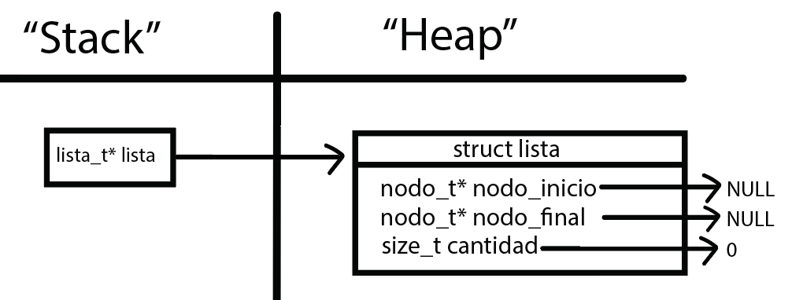
</div>


#### lista_insertar()
Esta función se encarga de insertar elementos al final de la lista. Para ello, reserva un nodo en el heap y posteriormente, carga el nodo con el elemento que va a contener y su siguiente es `NULL`, ya que ahora es el nuevo nodo final. En el caso de que la lista esté vacía, se inserta el nuevo nodo en el inicio. Si la lista ya contiene elementos, se itera hasta el final y se lo inserta apuntando el último nodo de la lista al nuevo nodo a insertar, y el siguiente de ese a `NULL`.

<div align="center">
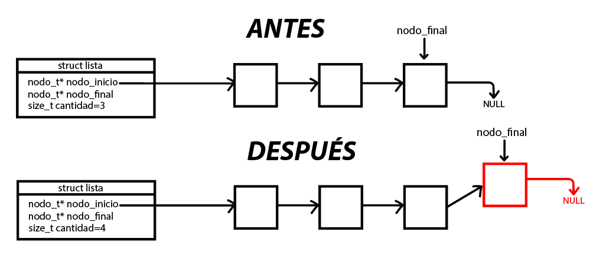
</div>


#### lista_insertar_en_posicion()

Esta función se encarga de insertar un nuevo elemento en una posición seleccionada por el usuario, donde 0 es la primer posición. Devuelve `NULL` si no se pudo insertar el elemento a causa de un error, o la lista en caso de éxito. Para esto, se reserva memoria para el nuevo nodo en el heap y se carga dicho nodo con el elemento que el usuario desea agregar a la lista. Si la lista está vacía, se inserta el nodo al inicio de la lista, si la posición a guardar es `0`, se apunta `nodo_inicio` hacia el nuevo nodo y el siguiente de este es el resto de la lista. En el caso de que la posición ingresada por el usuario no exista, se inserta el nodo al final de la lista. Si la posición existe, entonces se recorre hasta una posición antes de la deseada, y se apunta el siguiente de ese nodo al nuevo, y el siguiente del nuevo al que le proseguía el anterior. Esto suena confuso pero es mejor explicarlo con un diagrama.

<div align="center">
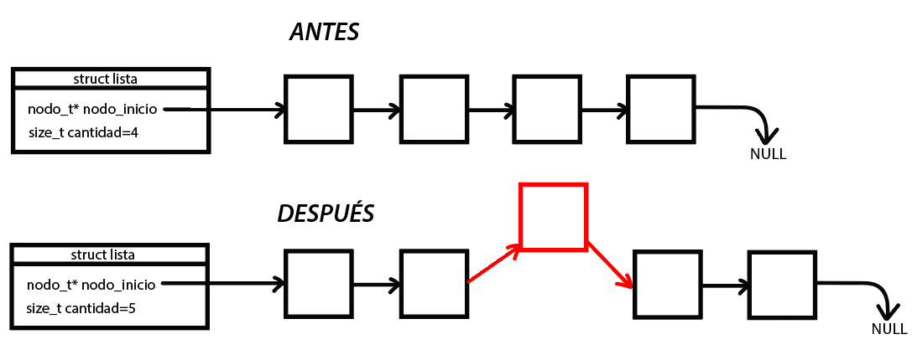
</div>


#### lista_quitar()
Esta función quita el elemento que se encuentra en la última posición. Devuelve el elemento removido de la lista o NULL en caso de que la lista esté vacía o sea nula. Se recorre la lista hasta la posición anteúltima, se quita y libera el último nodo (salvando en una variable auxiliar el dato que contiene para luego retornarlo), y se apunta el último nodo a `NULL`. Se decrementa el contador de la cantidad de elementos de la lista.

<div align="center">
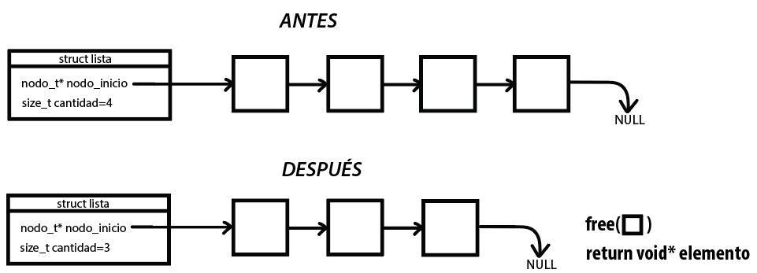
</div>

#### lista_quitar_de_posicion()

Esta función quita de la lista el elemento que se encuentra en la posición indicada, donde 0 es el primer elemento de la lista. En caso de no existir esa posición se intentará borrar el último elemento. Devuelve el elemento removido de la lista o NULL en caso de error. Se recorre la lista, hasta una posición anterior a la deseada y se guarda en una variable auxiliar la dirección del nodo a quitar. Se apunta el nodo de la posición anterior al siguiente del que se desea eliminar. Una vez reorganizada la lista, se libera la memoria ocupada por el nodo a eliminar y se retorna el elemento que contiene. Se decrementa el contador de la cantidad de elementos de la lista.

<div align="center">
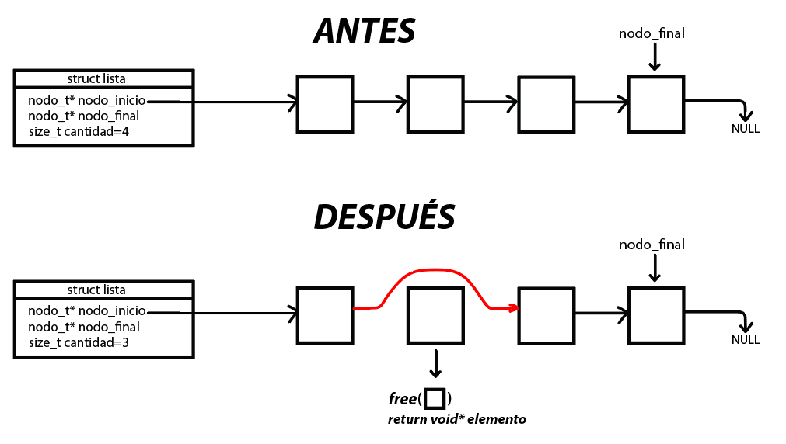
</div>


#### lista_elemento_en_posicion()

Esta función devuelve el elemento en la posición indicada, donde 0 es el primer elemento. Si la lista es nula, está vacía o la posición no existe, devuelve NULL. Es simple, se recorre la lista hasta la posición del nodo deseado y se retorna al módulo invocante el elemento que este contiene.

<div align="center">
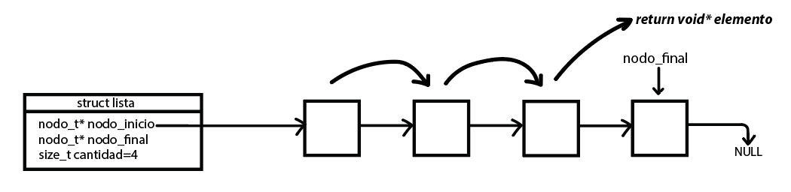
</div>

#### lista_buscar_elemento()

Devuelve el primer elemento de la lista que cumple la condición comparador(elemento, contexto) == 0. Si la lista es nula, vacía, o no exite el elemento que cumpla la condición, devuelve NULL. Se recorre toda la lista hasta encontrar dicho valor, en caso de encontrarlo, se devuelve.

<div align="center">
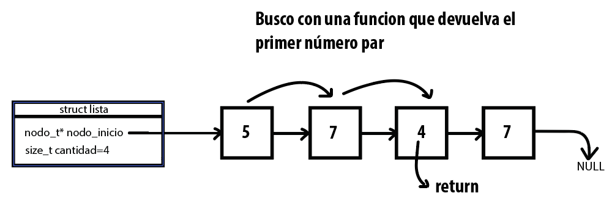
</div>

#### lista_primero()

Devuelve el primer elemento de la lista o NULL si la lista es nula o está vacía.

#### lista_ultimo()
Devuelve el último elemento de la lista o NULL si la lista es nula o está vacía.

#### lista_vacia()
Devuelve true si la lista está vacía (o no existe) o false en caso de que existan elementos. Para ello, se procede a examinar el nodo inicial o la cantidad de elementos. Si la cantidad de elementos es `0` o el nodo inicial es `NULL`, no hay elementos. 

#### lista_tamanio()
Esta función devuelve la cantidad de elementos almacenados en una lista. Si la lista es nula o está vacía, retorna `0`.

#### lista_destruir()

Esta función se encarga de liberar el espacio en el heap, tanto de la lista, como de cada uno de los nodos que la componen. Para ello, simplemente se recorre la lista, guardando la dirección del nodo anterior y liberando cada uno, hasta llegar al último. Luego de haber liberado todos los nodos, se libera la lista.

<div align="center">
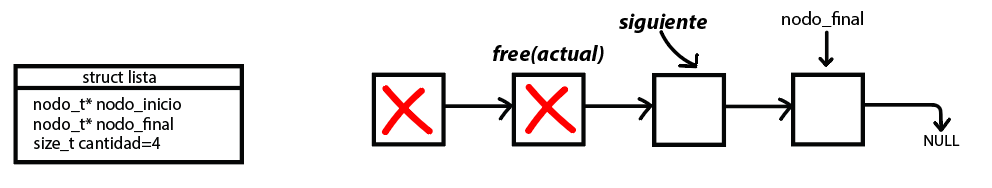
</div>

#### lista_destruir_todo()

Esta función realiza lo mismo que la anterior, pero además, le aplica una función a cada uno de los elementos de la lista. Si la función es `NULL`, se liberan los nodos y la lista, de la misma forma que la función `lista_destruir()`.

#### lista_iterador_crear()

 Esta función crea un iterador externo para una lista. El iterador creado es válido desde el momento de su creación hasta que no haya más elementos por recorrer o se modifique la lista iterada (agregando o quitando elementos de la lista). Para crearlo, se reservan bloques de memoria en el heap, utilizando `malloc()`. Una vez creado, se lo inicializa en la primera posición de la lista ingresada. Devuelve el puntero al iterador creado o NULL en caso de que la lista sea nula.

<div align="center">
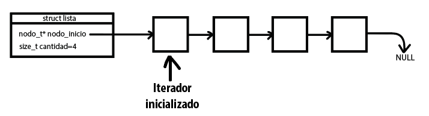
</div>

 #### lista_iterador_tiene_siguiente()

 Esta función recibe un iterador, devuelve true si hay más elementos sobre los cuales iterar o false si no hay mas. Es decir, si la posición actual del iterador es NULL, es porque ya no quedan más elementos sobre los cuales iterar.

 #### lista_iterador_avanzar()

 Esta función recibe un iterador. Avanza el iterador al siguiente elemento. Devuelve `true` si pudo avanzar el iterador o `false` en caso de que no queden elementos o en caso de error. En el caso de que se llegue al final del iterador, se itera por última vez y devuelve `false`.

<div align="center">
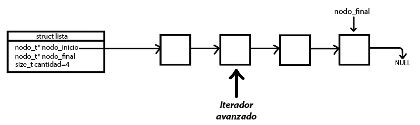
</div>

#### lista_iterador_elemento_actual()

Devuelve el elemento actual del iterador o NULL en caso de que no exista dicho elemento o en caso de error. Esta función es tan sencilla como retornar el elemento que se encuentra en la posición en la que apunta el iterador.

<div align="center">
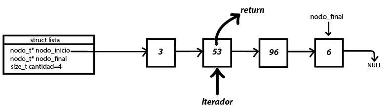
</div>

#### lista_iterador_destruir()

Esta función se encarga de liberar los bloques de memoria ocupados por el iterador en el heap con la función `free()`. Una vez liberado, se sale de la función sin retornar ningún valor.

<div align="center">
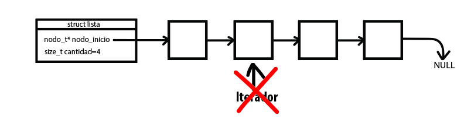
</div>

#### lista_con_cada_elemento()

Esta función es el iterador interno de la lista. Recorre la lista e invoca la función con cada elemento de la misma como primer parámetro. Dicha función puede devolver true si se deben seguir recorriendo elementos o false si se debe dejar de iterar elementos. El puntero contexto se pasa como segundo argumento a la función del usuario. Primero verifica si la lista (lista_t *lista) y la función del usuario son válidas. Si cualquiera de ellos es nulo, la función retorna 0 para indicar un error.
Luego, utiliza un `while()` para recorrer la lista, comenzando desde el primer elemento y avanzando al siguiente elemento en cada iteración. Dentro del bucle, llama a la función de usuario con el elemento actual y el contexto proporcionado, y se incrementa el contador elementos_iterados.
Finalmente, la función retorna el número total de elementos iterados.
<div align="center">
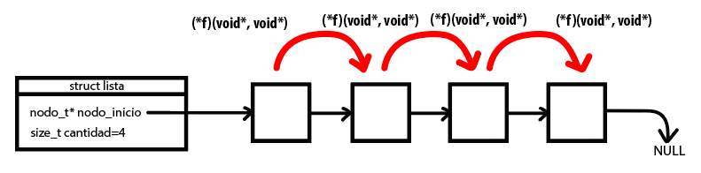
</div>

---

## Respuestas a las preguntas teóricas


¿Qué es una lista/pila/cola? Explicar con diagramas.

Una lista es un tipo de dato abstracto que almacena un conjunto ordenado de elementos. Cada elemento se llama nodo y consta de dos partes principales: un valor o dato y una referencia al siguiente nodo en la lista. La lista puede ser implementada de tres formas: Vector estático, vector dinámico o como una lista de nodos (utilizado en este TP). Los elementos de una lista pueden ser accedidos de manera secuencial, empezando desde el primer nodo y siguiendo las referencias al siguiente nodo. Las operaciones básicas de este TDA son: Crear, insertar, vacia, ver elemento, quitar, destruir (cada una de las operaciones fue explicada en detalle en el funcionamiento del TP).
Los tipos de lista son: simplemente enlazada, doblemente enlazada y circular.


<div align="center">
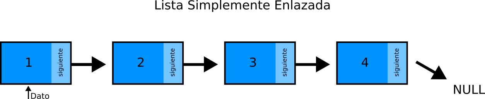
</div>

Pila:

Características: Una pila es un tipo de dato abstracto que sigue la normativa L.I.F.O. (Last in, first out), el último que entra, es el primero que sale. Esto significa que el último elemento añadido a la pila es el primero en ser eliminado. Los elementos de una pila solo pueden ser añadidos o eliminados desde un extremo, llamado tope de la pila. Las operaciones comunes son: Crear, destruir, push (añadir un elemento a la cima de la pila), pop (eliminar el elemento de la cima de la pila), tope (último elemento apilado) y vacía. Se puede implementar como vector estático, vector dinámico, o pila como lista de nodos.

<div align="center">
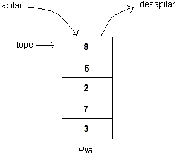
</div>

Cola:

Una cola es otro tipo de dato abstracto que sigue el principio F.I.F.O. (First In, First Out), el primer elemento en entrar es el último en salir. Esto significa que el primer elemento añadido a la cola es el primero en ser eliminado. Los elementos de una cola se añaden al final de la cola (final de la fila) y se eliminan desde el frente de la cola (frente de la fila).
Operaciones comunes: Encolar (añadir un elemento al final de la cola) y desencolar (eliminar el elemento del frente de la cola) (ademas de crear,destruir,vacia,primer). Un ejemplo cotidiano para entender el funcionamiento de una cola puede ser cuando vamos al supermercado, el primero que sale de la cola es el primero que entró en ella.

<div align="center">
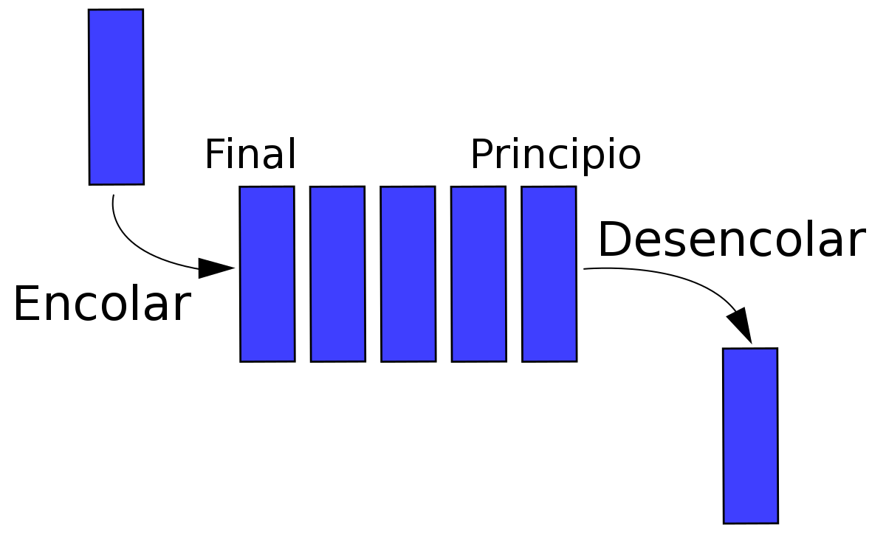
</div>

---
Explica y analiza las diferencias de complejidad entre las implementaciones de lista simplemente enlazada, doblemente enlazada y vector dinámico para las operaciones:
   - Insertar/obtener/eliminar al inicio
   - Insertar/obtener/eliminar al final
   - Insertar/obtener/eliminar al medio

### Al inicio:

#### Lista simplemente enlazada

**Insertar/Obtener/Eliminar al Inicio**: Estas operaciones de una lista simplemente enlazada son operaciones de complejidad O(1), ya que al no haber más elementos en la lista no se debe recorrer nada.


#### Lista Doblemente Enlazada:

**Insertar/Obtener/Eliminar al Inicio**: Estas operaciones al inicio de una lista doblemente enlazada también son de complejidad O(1), ya que se tienen punteros directos tanto al primer nodo como al último nodo, por lo que se puede acceder al primer nodo de forma directa sin recorrer la lista.

#### Vector Dinámico:

**Insertar al Inicio**: Insertar al inicio de un vector dinámico tiene una complejidad O(n), donde n es el número de elementos en el vector, ya que todos los elementos deben moverse una posición a la derecha para hacer espacio para el nuevo elemento.

**Obtener al Inicio**: Obtener el elemento al inicio es una operación de constante O(1).

**Eliminar al Inicio**: Eliminar al inicio es una operación de tiempo lineal O(n), ya que todos los elementos deben desplazarse una posición a la izquierda después de eliminar el elemento en la posición 0.

### En el Medio:

#### Lista Simplemente Enlazada:

**Insertar/Obtener/Eliminar en el Medio**: Estas operaciones en el medio de una lista simplemente enlazada es de complejidad O(n) (o mas bien O(n/2)), ya que debes recorrer la lista hasta la posición y ahí realizar la operación deseada.

#### Lista Doblemente Enlazada:

**Insertar/Obtener/Eliminar en el Medio**: Estas operaciones en el medio de una lista simplemente enlazada es de complejidad O(n) (o mas bien O(n/2)), ya que debes recorrer la lista hasta la posición y ahí realizar la operación deseada.

#### Vector Dinámico:

**Insertar en el Medio**: Insertar en el medio de un vector dinámico generalmente tiene una complejidad de tiempo lineal O(n) en el peor de los casos, esto se debe a que en un vector dinámico, los elementos están almacenados en un bloque contiguo de memoria, y la inserción en el medio implica desplazar todos los elementos posteriores para hacer espacio para el nuevo elemento.

**Obtener en el Medio**: Obtener el elemento en el medio es una operación de tiempo constante O(1).

**Eliminar en el Medio**: La eliminación en el medio tiene una complejidad de tiempo lineal O(n) en el peor de los casos, ya que todos los elementos después de la posición deseada deben desplazarse una posición hacia la izquierda.


### Al final:

#### Lista Simplemente Enlazada:

**Insertar/Obtener/Eliminar al Final**: Estas operaciones al final en una lista simplemente enlazada es de complejidad O(n), ya que debes recorrer toda la lista para llegar al último nodo.


#### Lista Doblemente Enlazada:

**Insertar/Obtener/Eliminar al Final**: Estas operaciones al final en una lista doblemente enlazada es de complejidad O(1) ya que puedes acceder al último nodo directamente y realizar cualquiera de las operaciones mencionadas, sin necesidad de recorrer la lista.

#### Vector Dinámico:

**Insertar/Obtener/Eliminar al Final**: Estas operaciones al final de un vector dinámico generalmente tiene una complejidad de O(1) si se utiliza una estrategia de crecimiento adecuada.

---
- Explica la complejidad de las operaciones implementadas en tu trabajo para la pila y la cola.

### PILA

#### pila_crear()

La complejidad de crear una pila vacía es O(1), el bloque se ejecuta una sola vez sin iteraciones.

#### pila_apilar()

La complejidad de apilar (push) es O(1), ya que se tiene que insertar el elemento en el tope de la pila, apuntando el nuevo tope al elemento insertado sin la necesidad de recorrer nada.

#### pila_desapilar()

La complejidad de desapilar(pop) es O(1), ya que se tiene que eliminar el elemento en el tope de la pila, liberando y apuntando el nuevo tope al elemento de abajo y reducir el contador de elementos, sin la necesidad de recorrer nada.

#### pila_tope()

La complejidad de obtener el elemento del tope es obviamente O(1), ya que lo único que hace es retornar el elemento que contiene el nodo tope.

#### pila_tamanio()

La complejidad de obtener la cantidad de elementos de la pila también es O(1), ya que definí en mi estructura un contador para la cantidad de elementos que se van apilando con el paso del tiempo.

#### pila_destruir()

La complejidad de destruir todos los nodos que componen la pila es O(n), ya que se debe recorrer las n cantidad de elementos que fueron apilados, liberando cada nodo y al final, la pila en sí.

### COLA

#### cola_crear()

La complejidad de crear una cola vacía es O(1), el bloque se ejecuta una sola vez sin iteraciones.

#### cola_encolar()

La complejidad de encolar (queue) es O(1), ya que se tiene que insertar el nuevo nodo en la posición del último en la cola, apuntando el nodo final al elemento insertado sin la necesidad de recorrer nada.

#### cola_desencolar()

La complejidad de desencolar(dequeue) es O(1), ya que se tiene que eliminar el último nodo de la cola, liberando y apuntando el nuevo último al elemento que le sigue, reducir el contador de elementos y retornar el elemento que contenía el nodo, sin la necesidad de recorrer nada.

#### cola_frente()

La complejidad de obtener el elemento del frente es obviamente O(1), ya que lo único que hace es retornar el elemento que contiene el nodo frente.

### cola_destruir()

La complejidad de destruir todos los nodos que componen la cola es O(n), ya que se debe recorrer las n cantidad de elementos que fueron encolados, liberando cada nodo y al final, la cola en sí.

